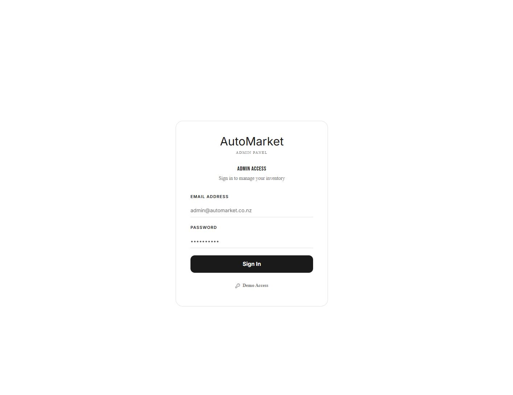
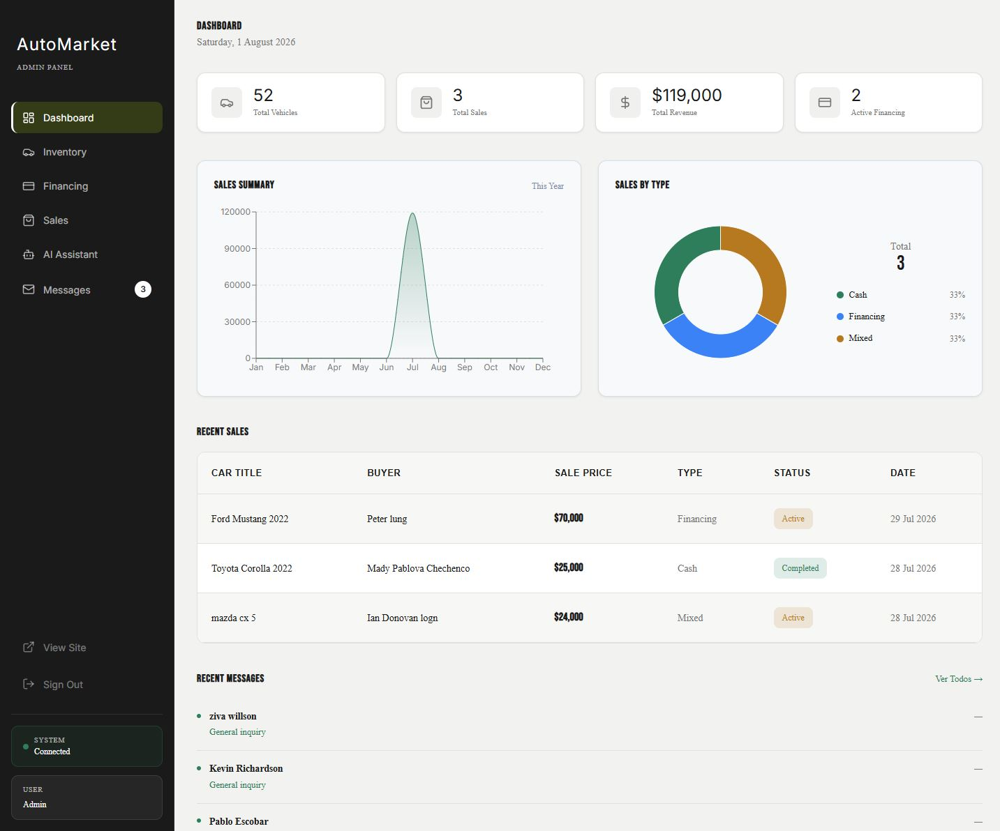
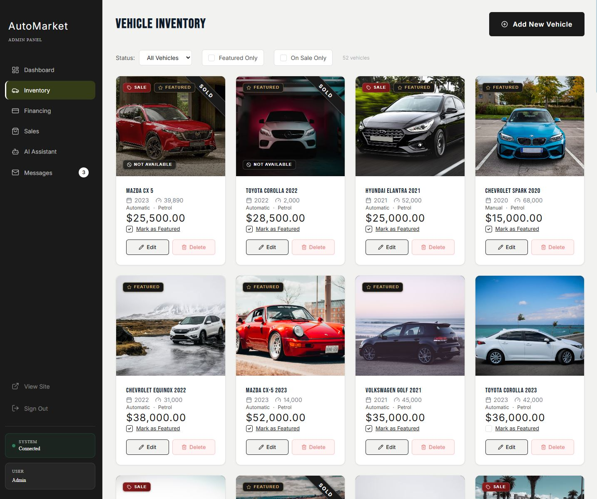
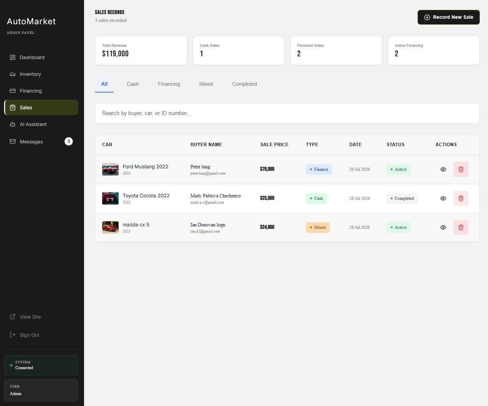
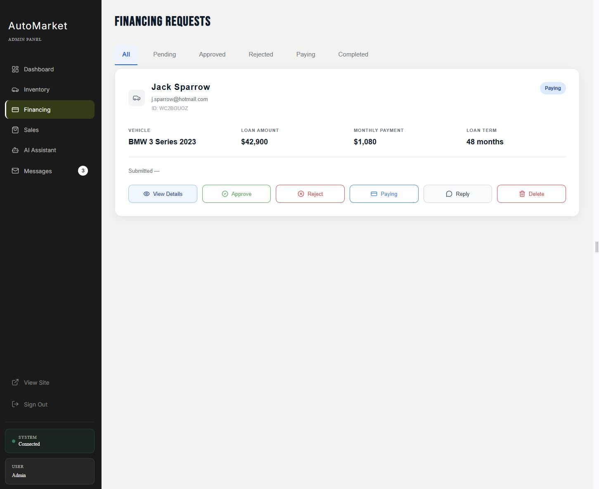
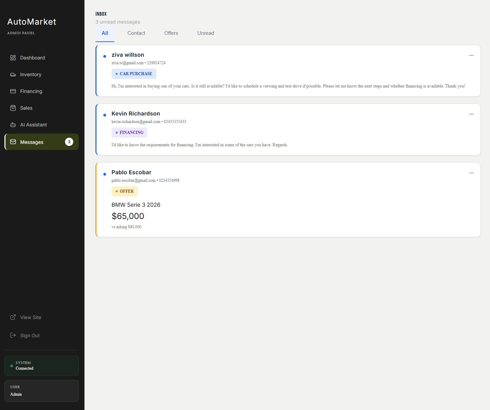
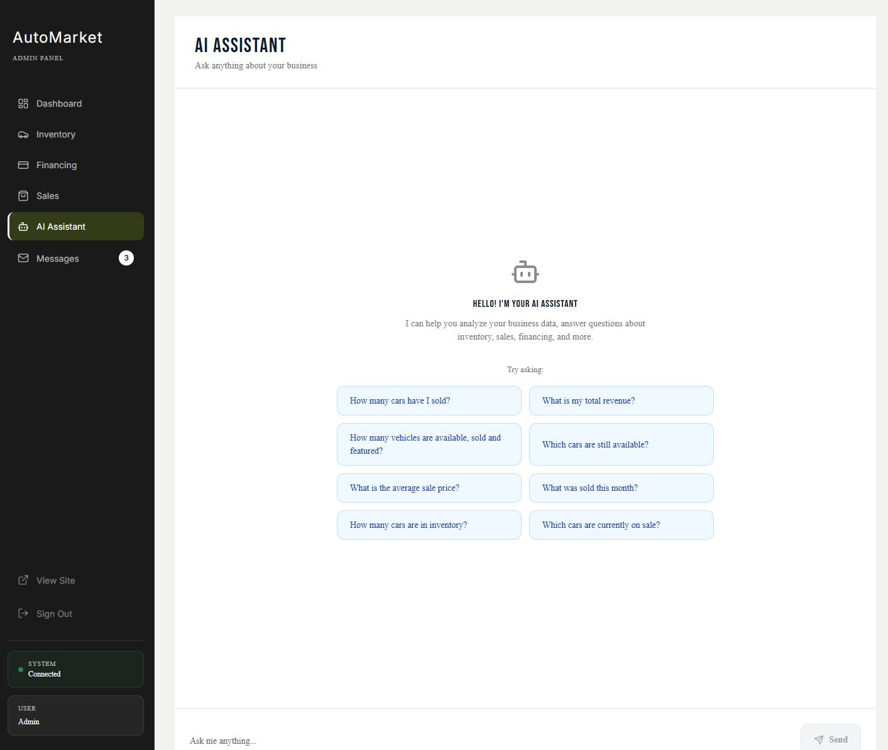
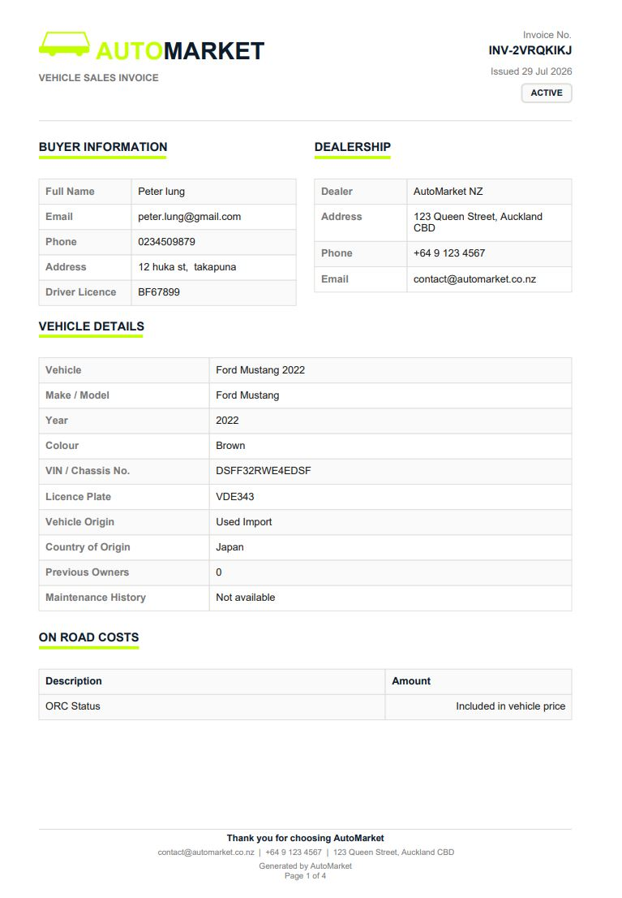

# AutoMarket Admin Panel

## Access

The admin panel is located at `/admin` and is protected by Firebase Authentication plus a
Firestore-backed role check (`users/{uid}.role`). There is no default/shared admin account and
**no real credentials are documented here** - every deployment creates its own.

### Roles

| Role | Read | Create / Update | Delete | User/role management |
| --- | --- | --- | --- | --- |
| `admin` | ✅ | ✅ | ✅ | ✅ |
| `demo`  | ✅ | ✅ | ❌ | ❌ |
| `user` / unset | ❌ (no admin-panel access) | ❌ | ❌ | ❌ |

The backend enforces this matrix independently of the UI (`requireAdmin` / `requireAdminOrDemo`
middleware in `server.js`) - a delete request crafted directly against the API with a demo token
is rejected with `403` regardless of what any button in the UI shows.

### Creating the real admin account

1. Firebase Console → Authentication → Users → **Add user** (choose your own email/password -
   never reuse an example value from this file).
2. Grant that user the `admin` role in Firestore:
   ```bash
   node scripts/bootstrap-admin.js "<firebase-uid>" "<email>"
   ```
3. Log in at `/admin/login` with the credentials you just created.

### Creating the recruiter-facing demo account

This is the account shown to recruiters/reviewers via the "Demo Access" modal on the login page -
it is intentionally public-facing, but it is **never** the real admin account, and it can never
delete data or manage users. See the root [`README.md`](README.md#create-the-recruiter-facing-demo-user-optional)
for the exact bootstrap command. Set `VITE_DEMO_ADMIN_EMAIL` / `VITE_DEMO_ADMIN_PASSWORD` in
`.env` to have those exact credentials surfaced in the modal.

### Rotating the real admin password

`admin@automarket.co.nz`-style admin accounts can be fictional/portfolio-only email addresses that
cannot receive a Firebase password-reset email. `scripts/reset-admin-password.js` rotates the
Firebase Authentication password for the real admin account directly via the Admin SDK, without
ever touching the UID, email, disabled state, or the Firestore role document.

Safety guarantees (see `src/test/resetAdminPassword.test.ts` for the enforced behavior):
- the new password is read **only** from `ADMIN_NEW_PASSWORD` and is never printed or logged, in
  any mode;
- the target email is read **only** from `ADMIN_USER_EMAIL`; both env vars are required or the
  script exits with an error;
- dry run is the default - no mutation happens unless `--execute` is passed;
- it refuses to run against the restricted demo account's email;
- it verifies the matching `users/{uid}` Firestore document has role **exactly** `admin` before
  proceeding, and refuses otherwise;
- it only calls `getAuth().updateUser(uid, { password })` - no other Auth field or the Firestore
  document is touched.

```powershell
# Dry run (default) - reports what would happen, no mutation
$env:ADMIN_USER_EMAIL="admin@example.com"
$env:ADMIN_NEW_PASSWORD="<new-private-password>"
node scripts/reset-admin-password.js

# Apply it
node scripts/reset-admin-password.js --execute
```

Replace `admin@example.com` and `<new-private-password>` with your own real values when you run
this - never commit or paste real credentials into this file or any commit message.

## Admin Features

### Dashboard (`/admin`)
- Overview stats: Total Vehicles, Total Sales, Total Revenue, Active/Pending Financing
- Monthly sales revenue chart and sales-by-payment-type breakdown
- Recent Sales table and Recent Messages preview
- Each data source loads independently (`Promise.allSettled`) - one section failing to load never
  blanks out the rest of the Dashboard

### Vehicle Inventory (`/admin/cars`)
- View all cars with filters (Available/Sold, Featured Only, On Sale Only)
- Toggle featured status inline
- Add (`/admin/cars/add`), edit (`/admin/cars/edit/:id`), and delete vehicles (delete is
  admin-only; the demo role sees the button disabled with an explanatory tooltip)
- Sold status is derived from the `sales` collection (never a manually-set flag), via the same
  centralized rule the public Home/Cars pages use

### Sales (`/admin/sales`)
- List, filter, and search recorded sales
- Multi-step **Record New Sale** flow (`/admin/sales/new`): vehicle selection, buyer information,
  payment plan (cash/financing/mixed), ORC and accessories, document upload (Cloudinary)
- Sale detail view (`/admin/sales/:id`) with PDF invoice generation
- Edit sale (`/admin/sales/edit/:id`), including marking individual scheduled payments
  paid/pending
- Delete is admin-only

### Financing Requests (`/admin/financing`)
- View all financing applications with status filters (Pending, Approved, Rejected, Paying,
  Completed)
- Update status, view/download uploaded supporting documents
- Delete is admin-only

### Messages Inbox (`/admin/messages`)
- View all contact and vehicle-offer messages
- Filter by type and read status; mark messages read/unread
- Delete is admin-only

### AI Assistant (`/admin/ai`)
- Natural-language business Q&A over live (sanitized) inventory/sales/financing/message data,
  powered by the Anthropic Claude API
- No buyer PII (name, email, phone, address, ID/licence) is ever included in the context sent to
  the model
- Has its own isolated rate-limit bucket, independent of ordinary admin navigation

## Firestore Collections

All collections below deny direct client reads/writes in `firestore.rules` (except `cars`, which
allows public reads for the customer-facing catalog) - every admin-panel read/write goes through
an authenticated Express endpoint using the Firebase Admin SDK, never the client Firestore SDK
directly.

### `users`
- Document ID: Firebase Auth UID
- Fields: `role` (`admin` | `demo` | `user`), `email`, `createdAt`, `updatedAt`, `source`

### `cars`
- Fields: `title`, `brand`, `model`, `year`, `price`, `originalPrice`, `isOnSale`, `km`,
  `transmission`, `fuel`, `color`, `description`, `ownerDescription`, `images[]`, `featured`,
  `createdAt`, `updatedAt`

### `financing`
- Fields: `carId`, `carTitle`, `firstName`, `lastName`, `email`, `phone`, `licenseNumber`,
  `monthlyIncome`, `downPayment`, `loanTerm`, `monthlyPayment`, `totalAmount`, `totalInterest`,
  `status`, `documents[]`, `createdAt`

### `messages`
- Fields: `type` (`contact` | `offer`), `senderName`, `email`, `phone`, `reason`, `message`,
  `read`, `carId`, `carTitle`, `offerPrice`, `createdAt`

### `sales`
- Fields: `carId`, `carTitle`, `carBrand`, `carModel`, `carYear`, `carColor`, `carImages[]`,
  `buyer` (`name`, `idNumber`, `email`, `phone`, `address`, `licenseNumber`), `paymentPlan`,
  `payments[]`, `status` (`active` | `completed` | `cancelled`), `saleDate`, `notes`,
  `vehicleInfo`, `orc`, `extraAccessories`, optional `financingFees` / `warranty` /
  `mechanicalInsurance` / `documents`, `createdAt`

## 📸 Admin Screenshots

> Public-facing screenshots live in [`README.md`](README.md#-public-screenshots) instead. See
> [`docs/screenshots/SCREENSHOT-GUIDE.md`](docs/screenshots/SCREENSHOT-GUIDE.md) for capture
> requirements if these ever need to be recaptured.

### Admin Login / Demo Access
Login form with the "Demo Access" modal open, showing the recruiter-facing credentials flow.



### Admin Dashboard
Populated dashboard metrics, charts, recent activity, and the Demo Mode indicator.



### Admin Inventory
Vehicle inventory list with sold/available/featured status badges.



### Admin Sales
Sales list with fictional sample records and status filters.



### Admin Financing
Financing applications list with status filters (Pending, Approved, Rejected, Paying, Completed).



### Admin Messages
Message inbox with a mix of read/unread contact and vehicle-offer messages.



### Admin AI Assistant
A sample business-analytics conversation with the Anthropic Claude-powered AI Assistant.



### Admin Invoice / Document
A generated sample PDF invoice with fictional buyer and vehicle data.



## Notes

- All times are in New Zealand timezone
- Prices are formatted in NZD (New Zealand Dollar)
- The admin panel does not display Navbar or Footer
- All admin/demo reads and writes go through the authenticated backend (`server.js`) - not a
  direct client Firestore connection
