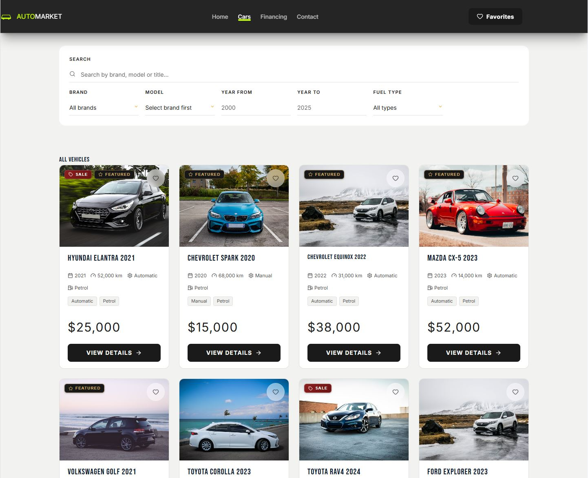
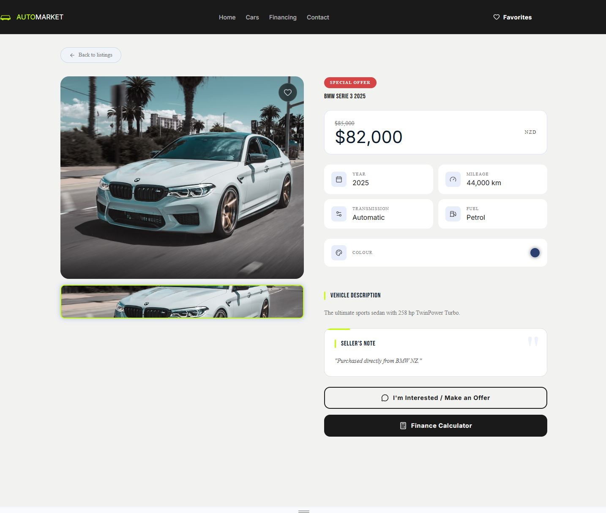
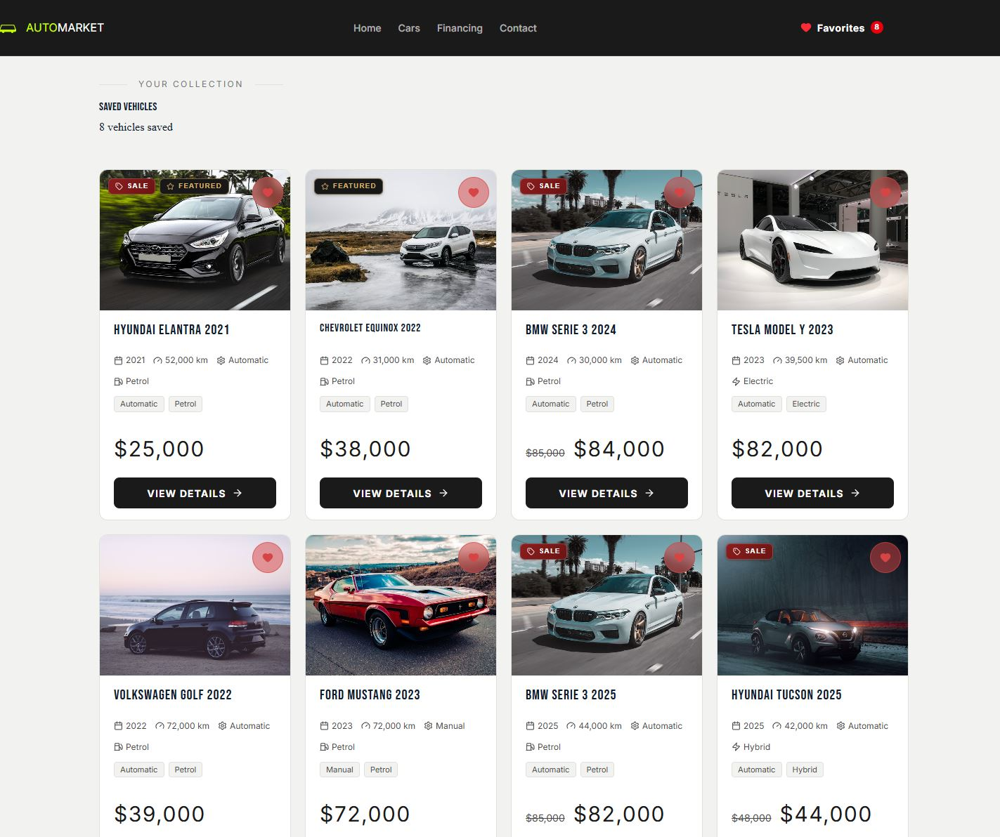
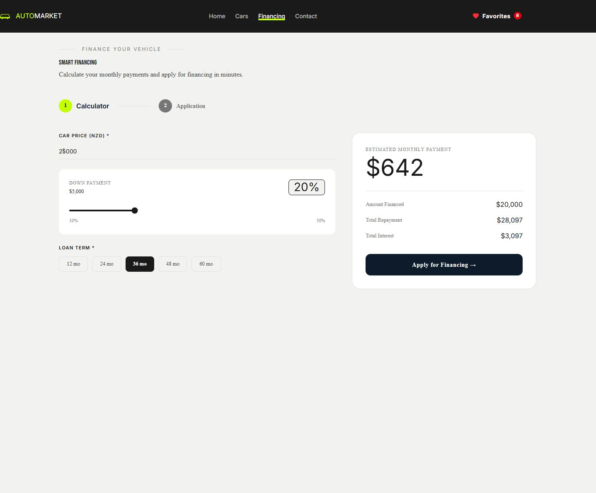
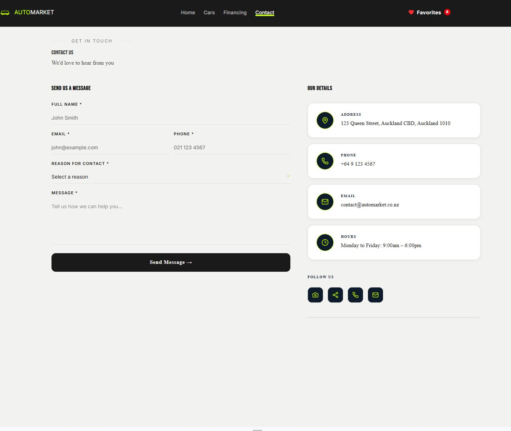

# AutoMarket 🚗

A professional full-stack automotive marketplace platform with AI-driven business analytics, real-time inventory management, and comprehensive admin controls built with React, TypeScript, Firebase, and Node.js.

**[Live Demo](https://automarket-ten.vercel.app)** | **[GitHub Repository](https://github.com/sergio-ripetti/automarket-)**

---

## 🎬 Try it now — recruiter/reviewer Demo Access

No account needed. Open the [live admin login](https://automarket-ten.vercel.app/admin/login) and click
**"Demo Access"** to reveal a restricted, read-mostly demo account (all data shown is fictional/sample).
The demo account can:

- browse the full Dashboard, Inventory, Financing, Sales, and Messages;
- create and edit ordinary records, change payment/workflow statuses, mark messages read/unread;
- use the AI Assistant and view sample invoices/documents.

It **cannot** delete anything or manage users/roles — every destructive/admin-only backend route
independently rejects the demo role's token server-side, regardless of what the UI shows. A
**Demo Mode** badge is shown in the sidebar for the whole session.

---

## 📋 Overview

AutoMarket is a complete automotive marketplace solution designed for dealership owners and sales teams. It provides a modern, responsive customer portal for browsing vehicles and applying for financing, combined with a powerful admin dashboard for managing inventory, sales, customer communications, and AI-assisted business analytics.

The platform demonstrates full-stack engineering best practices including secure API authentication, privacy-conscious data handling, real-time database operations, role-based authorization (admin/demo/user), and professional component architecture.

---

## ✨ Key Features

### Public Customer Portal
- **Vehicle Catalog** - Browse vehicles with advanced filtering (brand, price, year, fuel type, transmission)
- **Detailed Listings** - High-quality images, specs, and specifications
- **Favorites System** - Save vehicles with cross-session persistence
- **Financing Calculator** - Real-time loan calculations with adjustable terms
- **Contact Forms** - Direct messaging and financing inquiries

### Admin Dashboard
- **Inventory Management** - Add, edit, archive vehicles with bulk image upload
- **Sales Management** - Create complex multi-step sales with full financial tracking
- **Financing Workflow** - Review and approve financing applications with status tracking
- **Customer Communications** - Message inbox with read/unread status
- **Business Analytics** - Real-time dashboard with key metrics (sales, revenue, inventory)
- **AI Assistant** - Claude-powered business insights with secure, privacy-respecting data handling
- **PDF Invoices** - Professional invoice generation with detailed financial breakdowns

### Recruiter-Facing Demo Mode
- **Demo Access login** - A dedicated, restricted `demo`-role Firebase account, surfaced via a "Demo Access" modal on the admin login screen (credentials are public by design, shown only to explore the portfolio - never the real administrator)
- **Full read + ordinary write access** - the demo role can read all (fictional) business data, create/update cars/sales/financing records, change payment/workflow statuses, mark messages read/unread, and use the AI Assistant
- **No destructive access** - delete routes and user/role management are enforced admin-only on the backend (`requireAdmin`), independent of what the UI shows - the demo role's token is rejected server-side even if a delete request is crafted directly

### Security & Privacy
- **Firebase Authentication** - Admin login via Firebase, verified server-side with Firebase ID tokens (not a static API key) plus a Firestore-backed role check (`admin` / `demo` / `user`)
- **Backend-Mediated Data Access** - Sales, Financing, Messages, and user-role documents deny all direct client Firestore access; every read/write goes through authenticated Express endpoints backed by the Firebase Admin SDK
- **Public Sold-Vehicle Endpoint** - Home/Cars determine vehicle availability via a public endpoint that returns only sold vehicle IDs, never full sale records
- **Rate Limiting** - Three isolated buckets: a public/IP-keyed limiter for anonymous form submissions and the sold-vehicle lookup, a separate uid-keyed limiter for authenticated admin/demo routes, and its own isolated bucket for the AI endpoint - so normal admin navigation can never exhaust the AI assistant's allowance (or vice versa)
- **Privacy-First AI Context** - No buyer name, email, phone, address, or ID/licence data is included in the business context sent to the AI provider
- **CORS Protection** - Restricted to trusted origins only

---

## 📸 Public Screenshots

> Admin-panel screenshots live in [`README-ADMIN.md`](README-ADMIN.md#-admin-screenshots) instead.
> See [`docs/screenshots/SCREENSHOT-GUIDE.md`](docs/screenshots/SCREENSHOT-GUIDE.md) for capture
> requirements if these ever need to be recaptured.

### Public Home
Homepage hero, featured vehicles, and primary marketplace navigation.


### Vehicle Catalog
Full vehicle catalog with filters applied (brand, price, year, fuel type, transmission).



### Vehicle Detail
Individual vehicle detail page with images, specifications, and pricing.



### Favorites
Saved-vehicle list with cross-session persistence.



### Public Financing
Loan calculator with adjustable terms and real-time recalculation.



### Contact / Vehicle Inquiry
Contact form and vehicle-offer inquiry submission.



---

## 🏗️ Technology Stack

### Frontend
- **React 19** - Modern component architecture with hooks
- **TypeScript** - Full type safety with ESLint compliance
- **Vite** - Lightning-fast development server and optimized bundling
- **Tailwind CSS** - Responsive utility-first styling
- **Framer Motion** - Smooth page transitions and animations
- **React Router** - Client-side navigation

### Backend
- **Node.js + Express 5** - Lightweight, scalable server
- **Firebase/Firestore** - Real-time NoSQL database
- **Firebase Auth** - User authentication and management
- **Anthropic Claude API** - AI-powered business analytics

### External Services
- **Cloudinary** - Image hosting and transformation
- **Vercel** - Serverless deployment and hosting

### Development Tools
- **ESLint** - Code quality enforcement
- **TypeScript Compiler** - Zero-tolerance type checking
- **npm** - Dependency management

---

## 🗂️ Project Structure

```
automarket/
├── src/
│   ├── pages/                  # Route-level components
│   │   ├── Home.tsx           # Landing page with featured vehicles
│   │   ├── Cars.tsx           # Vehicle catalog with filters
│   │   ├── CarDetail.tsx      # Individual vehicle details
│   │   ├── Financing.tsx      # Financing application
│   │   ├── Contact.tsx        # Contact/offer form
│   │   └── admin/             # Protected admin pages
│   │       ├── AdminLogin.tsx (includes recruiter-facing "Demo Access" modal)
│   │       ├── AdminDashboard.tsx
│   │       ├── AdminCars.tsx / AdminEditCar.tsx
│   │       ├── AdminNewSale.tsx (multi-step sale creation) / AdminEditSale.tsx
│   │       ├── AdminSaleDetail.tsx
│   │       ├── AdminFinancing.tsx
│   │       ├── AdminMessages.tsx
│   │       └── AdminAI.tsx    # AI analytics assistant
│   ├── components/            # Reusable UI components
│   │   ├── ui/               # Foundational components (Button, Card, Input, Badge)
│   │   ├── admin/            # Admin-specific components (AdminLayout, DemoAccessModal, ProtectedRoute)
│   │   ├── shared/           # Shared form components
│   │   ├── Navbar.tsx
│   │   ├── Footer.tsx
│   │   ├── CarCard.tsx       # Vehicle listing card
│   │   └── FilterBar.tsx     # Search and filter controls
│   ├── hooks/                # Custom React hooks
│   │   ├── useCars.ts        # Firestore car queries
│   │   ├── useUserRole.ts    # Resolves admin/demo/user role via GET /api/me
│   │   └── useToast.ts       # Toast notifications
│   ├── context/              # React Context
│   │   └── AuthContext.tsx   # Authentication state
│   ├── lib/                  # Utilities and services
│   │   ├── firebase.ts       # Firebase initialization
│   │   ├── authService.ts    # Auth operations
│   │   ├── demoAccessConfig.ts # Public demo credentials (env-driven, fails safe)
│   │   ├── carsService.ts    # Car database operations
│   │   ├── salesService.ts   # Sales management (types, validation)
│   │   ├── financingService.ts
│   │   ├── messagesService.ts
│   │   ├── userAuthorizationService.js # Role resolution + admin/demo permission matrix
│   │   ├── authMiddleware.js # Express middleware: authenticate, requireAdmin, requireAdminOrDemo
│   │   ├── cloudinaryService.ts
│   │   ├── invoiceService.ts # PDF generation
│   │   ├── sanitize.ts       # Data sanitization
│   │   ├── formatting.ts     # Shared formatting utilities
│   │   └── validators.js     # Shared frontend/backend validators (security, PII sanitization)
│   ├── types/                # TypeScript interfaces
│   │   └── index.ts
│   ├── data/                 # Static data
│   │   └── cars.ts          # Sample car catalog
│   ├── App.tsx               # Main router
│   └── main.tsx              # Entry point
├── server.js                 # Express backend
├── scripts/
│   ├── bootstrap-admin.js       # Grants the admin role to an existing Firebase Auth user
│   └── bootstrap-demo-user.js   # Creates/aligns the restricted recruiter-facing demo account
├── docs/
│   ├── USER_ROLES_AND_SECURITY.md
│   ├── OWNER_VERIFICATION_CHECKLIST.md
│   └── screenshots/             # README screenshot assets (see docs/screenshots/README.md)
├── firestore.rules           # Firestore security rules (backend-mediated access)
├── package.json              # Dependencies
├── tsconfig.json             # TypeScript configuration
├── vite.config.ts            # Vite configuration
├── tailwind.config.js        # Tailwind CSS config
└── .env.example              # Environment template
```

---

## 🚀 Getting Started

### Prerequisites
- **Node.js 18+** - [Download](https://nodejs.org/)
- **npm 9+** - Included with Node.js
- **Firebase project** - [Create one](https://console.firebase.google.com)
- **Cloudinary account** - [Free tier available](https://cloudinary.com/users/register_free)
- **Anthropic API key** - [Get one](https://console.anthropic.com/)

### Installation

1. **Clone the repository**
   ```bash
   git clone https://github.com/sergio-ripetti/automarket-.git
   cd automarket-
   ```

2. **Install dependencies**
   ```bash
   npm install
   ```

3. **Create environment file**
   ```bash
   cp .env.example .env
   ```

4. **Configure environment variables** (see Environment Variables section below)

5. **Start development server**
   ```bash
   npm run dev
   ```
   - Frontend: http://localhost:5173
   - Backend: http://localhost:3001

---

## 🔧 Environment Variables

### Frontend Variables (Required)

**AI Service:**
```
VITE_ANTHROPIC_API_KEY=sk-ant-...
```
- Anthropic API key for frontend AI features
- Get from: https://console.anthropic.com/

**API Configuration:**
```
VITE_API_BASE_URL=
```
- Leave empty for development (uses Vite proxy)
- **Required in Vercel Production/Preview**: set to the deployed backend's origin, e.g.
  `https://your-backend-host.example.com` - no trailing slash, and do **not** append `/api`
  (every request already includes `/api/...` in its path)
- Without this set in production, `/api/...` requests fall through to Vercel's SPA rewrite and
  receive `index.html` instead of JSON
- Redeploy after changing this - Vite environment variables are baked in at build time

### Backend Variables (Required)

**Firebase Admin SDK** (for AI endpoint authentication):
```
FIREBASE_ADMIN_SDK_DISABLED=true        # For development
```
Or for production:
```
FIREBASE_SERVICE_ACCOUNT=<base64-encoded-service-account-json>
```
or
```
GOOGLE_APPLICATION_CREDENTIALS=/path/to/serviceAccountKey.json
```

**AI Service:**
```
ANTHROPIC_API_KEY=sk-ant-...
```
- Anthropic API key for the backend
- Get from: https://console.anthropic.com/

**Cloudinary (Admin API):**
```
CLOUDINARY_CLOUD_NAME=
CLOUDINARY_API_KEY=
CLOUDINARY_API_SECRET=
```
- Required to delete Sales documents/photos from Cloudinary when removed in Edit Sale
- Get from: https://console.cloudinary.com/settings/api-keys

**Deployment:**
```
FRONTEND_URL=https://yourdomain.com
```
- Frontend URL for CORS validation
- Defaults to `https://automarket-ten.vercel.app`
- Update this for your production deployment

**Render (backend runtime, optional):**
```
NODE_VERSION=22
```
- Only relevant if deploying via `render.yaml` (see Deployment section below)

---

## 🔐 Firebase Configuration

### Setup Firestore Collections

The application uses these Firestore collections:

1. **`cars`** - Vehicle inventory
2. **`sales`** - Completed transactions
3. **`financing`** - Finance applications
4. **`messages`** - Customer inquiries

### Initialize Firebase

1. Create a Firebase project at https://console.firebase.google.com
2. Enable Firestore Database (start in test mode for development)
3. Enable Firebase Authentication (Email/Password)
4. Get your Firebase config:
   - In Firebase Console: Project Settings → General
   - Copy the config object values

5. Update `src/lib/firebase.ts` with your config:
   ```typescript
   const firebaseConfig = {
     apiKey: "YOUR_API_KEY",
     authDomain: "YOUR_AUTH_DOMAIN",
     projectId: "YOUR_PROJECT_ID",
     storageBucket: "YOUR_STORAGE_BUCKET",
     messagingSenderId: "YOUR_MESSAGING_SENDER_ID",
     appId: "YOUR_APP_ID"
   };
   ```

### Create Admin User

1. In Firebase Console: Authentication → Users
2. Add a new user with email and password
3. Grant that user the admin role in the `users/{uid}` Firestore document:
   ```bash
   node scripts/bootstrap-admin.js "firebase-uid-123" "you@example.com"
   ```
4. Use these credentials to log into the admin panel at `/admin/login`

### Create the Recruiter-Facing Demo User (optional)

To offer the same "Demo Access" experience this project's own live demo uses, bootstrap a
dedicated, restricted `demo`-role account (idempotent - safe to re-run):

```bash
# Dry run (default) - reports what would happen, no mutation
node scripts/bootstrap-demo-user.js --email demo@example.com --password '<choose one>'

# Apply it
node scripts/bootstrap-demo-user.js --email demo@example.com --password '<choose one>' --execute
```

The script refuses to run against any account whose role is already `admin`, and never resets the
password or `createdAt` of an existing demo account. Set `VITE_DEMO_ADMIN_EMAIL` /
`VITE_DEMO_ADMIN_PASSWORD` in `.env` to surface those credentials in the login page's "Demo
Access" modal.

---

## 🔒 Firestore Rules

`firestore.rules` denies all direct client access to `sales`, `financing`, `messages`, and `users` (only the backend, via the Firebase Admin SDK, can read/write them - the Admin SDK bypasses client security rules by design). `cars` allows public reads since that data is meant to be publicly browsable; all writes to every collection are backend-only.

```bash
# Point the Firebase CLI at the right project (or pass --project explicitly below)
firebase use automarket-710a5

# Run the rules test suite against the local emulator (requires JDK 21+)
npm run test:firestore-rules

# Deploy rules to the live project
firebase deploy --only firestore:rules --project automarket-710a5
```

---

## 🖼️ Cloudinary Configuration

Cloudinary hosts vehicle images and uploaded documents.

1. Create a free account at https://cloudinary.com/users/register_free
2. In Dashboard, note your:
   - Cloud Name
   - API Key

3. Create an upload preset:
   - Settings → Upload → Add upload preset
   - Set to "Unsigned" for easier uploads
   - Name it something like `automarket_uploads`

4. The application uses Cloudinary's JavaScript SDK for client-side uploads

---

## 🛠️ Development Commands

```bash
# Start Vite dev server + Express backend (recommended)
npm run dev

# Start only frontend dev server
npm run dev:client

# Start only backend server
npm run dev:server

# Production build (TypeScript + Vite)
npm run build

# Preview production build
npm run preview

# Lint code quality
npm run lint

# Run automated tests
npm run test

# Bootstrap the recruiter-facing demo account (dry run by default; --execute to apply)
npm run bootstrap:demo-user -- --email demo@example.com --password '<choose one>'
```

---

## 🔐 Security Architecture

### Authentication & Authorization
- **Frontend:** Firebase Authentication (email/password) for admin/demo login
- **Backend:** every protected endpoint verifies a Firebase ID token (`Authorization: Bearer <token>`) via the Firebase Admin SDK, then checks the role stored in Firestore (`users/{uid}.role`) - there is no static API key
- **Roles:** `admin` (full access), `demo` (read/create/update, never delete or user/role management), `user`/unset (no admin-panel access)
- **Rate Limiting:** three isolated buckets - a public/IP-keyed limiter for anonymous routes, a uid-keyed limiter for authenticated admin/demo routes, and a separate uid-keyed limiter for the AI endpoint, so ordinary navigation can never exhaust another bucket's allowance
- **CORS:** restricted to a fixed allowlist of trusted origins

### Data Protection
- **Backend-mediated Sales/Financing:** `firestore.rules` denies all direct client access to `sales` and `financing` (both can contain buyer/customer data); every read and write goes through an authenticated Express endpoint using the Firebase Admin SDK
- **Public availability endpoint:** the public Home/Cars pages get vehicle availability from `GET /api/public/sold-vehicle-ids`, which returns only sold vehicle IDs - never buyer data, payment details, or full sale records
- **Environment Variables:** all secrets in `.env` (never committed)
- **No PII Logging:** customer names, emails, phones, IDs, and licence numbers are never logged, and are stripped before the business context reaches the AI endpoint
- **AI Privacy:** the AI's business context is bounded (capped vehicle/sale counts) and validated server-side; buyer PII is excluded before it ever leaves the browser

### Input Validation
- **Message Length:** 1–5000 characters
- **Conversation Limit:** Maximum 50 messages per request
- **Server-side validators:** required fields, string/array bounds, and status-value checks on every write endpoint, independent of frontend validation
- **Type Checking:** Full TypeScript compile-time validation

This is a portfolio project, not an audited production system - the security model above reflects deliberate design decisions, not a claim of exhaustive or bank-grade security review.

---

## 📊 Building for Production

### Environment Setup
1. Update `FRONTEND_URL` to your deployed domain
2. Deploy `firestore.rules` (see [Firestore Rules](#-firestore-rules) below)
3. Configure Firebase Admin SDK for production (`FIREBASE_SERVICE_ACCOUNT` or `GOOGLE_APPLICATION_CREDENTIALS`)
4. Ensure all required API keys are configured

### Deployment (Vercel frontend + Render backend)

The frontend (Vercel) and backend (`server.js`, a separate Express host) are deployed
independently - Vercel's rewrites only serve the SPA, so there is **no** `/api/*` proxy
configured there. The frontend must be told the backend's real origin via `VITE_API_BASE_URL`.

1. **Backend (Render):**
   - `render.yaml` in the repo root defines the service (Node, `npm install` / `npm start`,
     health check at `/health`)
   - Render Dashboard → New → Blueprint → connect this repository → select `render.yaml`
   - Set the required secret environment variables in the Render UI (never commit them):
     `FRONTEND_URL`, `FIREBASE_SERVICE_ACCOUNT` (or `GOOGLE_APPLICATION_CREDENTIALS`),
     `ANTHROPIC_API_KEY`, `CLOUDINARY_CLOUD_NAME`, `CLOUDINARY_API_KEY`, `CLOUDINARY_API_SECRET`
   - Once live, note the service's HTTPS origin (e.g. `https://automarket-api.onrender.com`)
2. **Frontend (Vercel):**
   - Automatically deployed from GitHub
   - Project → Settings → Environment Variables → add `VITE_API_BASE_URL` = the Render backend
     origin from step 1 (Production, and Preview if previews should hit the same backend)
   - Redeploy the latest commit after setting/changing this variable
3. **CORS:** the backend's `FRONTEND_URL` must match the Vercel production domain exactly (a
   trailing slash is tolerated) or the browser will reject cross-origin responses

### Build Output
```
dist/                    # Production frontend bundle
dist/assets/            # Optimized CSS and JS
dist/index.html         # Entry HTML
```

---

## 🧪 Testing

### Manual QA Checklist

**Public Experience:**
- [ ] Home page loads with featured vehicles
- [ ] Vehicle catalog displays with working filters
- [ ] Vehicle detail page shows correct info
- [ ] Financing form calculates loan amounts correctly
- [ ] Contact form submits successfully
- [ ] Responsive design works on mobile/tablet/desktop

**Admin Experience:**
- [ ] Login/logout works
- [ ] Protected routes redirect to login
- [ ] Can create vehicle with images
- [ ] Can edit and delete vehicles
- [ ] Sales workflow completes end-to-end
- [ ] PDF invoice generates correctly
- [ ] AI assistant responds to queries
- [ ] Rate limiting blocks excessive requests

**Demo Access (recruiter-facing):**
- [ ] "Demo Access" modal on `/admin/login` shows working credentials and fills the form on click
- [ ] Demo login succeeds and shows the **Demo Mode** badge in the sidebar
- [ ] Dashboard, Inventory, Financing, Sales, Messages all load real (fictional) data while signed in as demo
- [ ] Demo can create/edit records, change statuses, mark messages read/unread, and use the AI Assistant
- [ ] Every delete button is disabled/hidden for the demo role, and a direct delete request still gets rejected server-side (403)

### Automated Tests

```bash
npm test                     # Full Vitest suite (unit, integration, security, accessibility)
npm run test:firestore-rules # Firestore security rules against the local emulator (requires JDK 21+)
```

The suite covers unit tests, integration tests, security/PII-sanitization tests, and accessibility checks for the admin panel, alongside a separate Firestore rules test file that verifies read/write access at the security-rule level.

*As of the last full run (July 2026): 1,407 automated tests across 94 test files, plus 36 Firestore rules tests. Exact counts will drift as the project evolves - run the commands above for the current numbers.*

---

## ⚠️ Known Limitations

1. **Firestore Cost:** Test mode allows unlimited reads/writes; configure billing limits in production
2. **Image Storage:** Cloudinary free tier has usage limits
3. **AI Costs:** Anthropic API charges per token; monitor usage
4. **Bundle Size:** Main chunk is ~550KB gzipped; route-level code splitting recommended for scaling

---

## 🎯 Performance Notes

### Current Metrics
- **Build Size:** ~546 KB gzipped
- **Largest Chunk:** PDF generation and analytics bundles
- **API Response:** ~200-500ms depending on AI model load

### Future Optimizations
- Lazy-load PDF generation library
- Route-level code splitting for admin features
- Image lazy-loading for vehicle gallery
- Caching strategy for Firestore queries

---

## 📝 Architecture Decisions

### Why Firebase?
- Real-time database for live inventory
- Built-in authentication
- Serverless scaling
- Free tier suitable for portfolio

### Why Anthropic Claude?
- State-of-the-art AI for business analysis
- Safety features reduce harmful outputs
- Clean API for integration

### Why React + TypeScript?
- Type safety catches bugs at compile time
- React ecosystem mature and well-documented
- Demonstrates professional engineering practices

---

## 🤝 Contributing

This is a portfolio project. For improvements or bug reports:
1. Fork the repository
2. Create a feature branch
3. Submit a pull request with clear description

---

## 📞 Support & Questions

- **Issues:** Open a GitHub issue for bugs or feature requests
- **Documentation:** See [`docs/USER_ROLES_AND_SECURITY.md`](docs/USER_ROLES_AND_SECURITY.md) and [`docs/OWNER_VERIFICATION_CHECKLIST.md`](docs/OWNER_VERIFICATION_CHECKLIST.md)
- **Email:** [Your contact email]

---

## 📄 License

This project is licensed under the MIT License - see the [LICENSE](LICENSE) file for details.

---

## 🙏 Acknowledgments

- **Anthropic** - Claude API for business intelligence
- **Firebase** - Real-time database and authentication
- **Cloudinary** - Image hosting and transformation
- **Vercel** - Deployment and hosting

---

**Last Updated:** July 2026  
**Current Version:** 1.0.0  
**Status:** Production Ready
